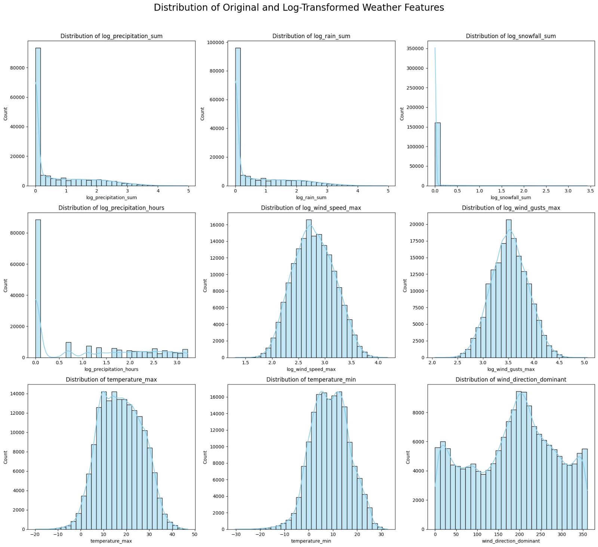
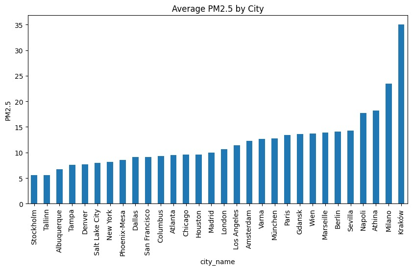

# MSDS696 – Data Practicum II

# City-Level PM2.5 Air Quality Forecasting

## Project Overview (Who, What, Why, When, How)

This project was developed as part of the MSDS696 Data Practicum II coursework, with the goal of demonstrating an end-to-end, industry-aligned data science workflow — from raw data ingestion to model training, evaluation, and reproducible deployment.

The project focuses on **forecasting daily city-level PM2.5 concentrations**, a critical air quality indicator linked to respiratory and cardiovascular health risks.

Air pollution remains one of the most pressing global public health challenges. Accurate and interpretable PM2.5 forecasts can assist:

* Public health authorities in issuing early warnings
* Urban planners in designing mitigation strategies
* Policymakers in evaluating environmental interventions

The project was executed iteratively over an **8-week development timeline**, following a structured data science lifecycle: data collection, exploratory analysis, feature engineering, modeling, evaluation, and refinement.

By integrating **historical air quality data** with **meteorological variables**, the project applies advanced machine learning models to capture temporal patterns, weather interactions, and city-specific behavior influencing PM2.5 levels.

---

## Problem Statement

The objective of this project is to:

> **Accurately forecast daily PM2.5 concentrations at the city level using historical air quality and weather data.**

This is framed as a **supervised regression and time-series forecasting problem**, where PM2.5 is the target variable and weather, temporal, and lag-based features act as predictors.

---

## Key Project Elements (Summary Table)

| Element                | Description                                         | Rationale                                |
| ---------------------- | --------------------------------------------------- | ---------------------------------------- |
| **Problem**            | City-level PM2.5 forecasting                        | Enables proactive air quality management |
| **Target Variable**    | PM2.5 concentration (µg/m³)                         | Widely used air pollution metric         |
| **Air Quality Data**   | EEA, USEPA                                          | Trusted governmental sources             |
| **Weather Data**       | Open-Meteo API                                      | High-resolution, open-access forecasts   |
| **Methods**            | Time-series forecasting, ML regression              | Captures temporal & nonlinear effects    |
| **Models Used**        | Random Forest, Gradient Boosting, XGBoost, CatBoost | Progressive model comparison             |
| **Evaluation Metrics** | RMSE, R²                                            | Measures accuracy and explanatory power  |
| **Final Outcome**      | Robust PM2.5 prediction model                       | High predictive performance              |

---

## Data Sources

### 1. Air Quality Data (PM2.5)

* **Sources:**

  * European Environment Agency (EEA)
  * U.S. Environmental Protection Agency (USEPA)
* **Description:**

  * Daily PM2.5 concentration values aggregated at the city level
  * Serves as the primary response variable
* **Links:**

  * [https://www.eea.europa.eu](https://www.eea.europa.eu)
  * [https://www.epa.gov/outdoor-air-quality-data](https://www.epa.gov/outdoor-air-quality-data)

### 2. Meteorological Data

* **Source:** Open-Meteo API
* **Description:**

  * Daily weather features including temperature, precipitation, wind speed, wind direction, and snowfall
  * These variables directly affect pollutant dispersion and accumulation
* **Link:** [https://open-meteo.com/](https://open-meteo.com/)




---

## Methodology and Workflow

### 1. Data Preprocessing

* Deduplication using city–date keys
* Filling missing dates for each city
* Linear interpolation and mean imputation for missing PM2.5 values
* Log transformation of skewed variables (e.g., precipitation, wind speed)

### 2. Exploratory Data Analysis (EDA)

* Distribution analysis using histograms and KDE plots
* Outlier detection via boxplots
* Correlation analysis with heatmaps
* Temporal trend analysis for PM2.5 and weather features

### 3. Feature Engineering

* Temporal features: year, month, day, weekday, weekend indicator
* Lag features: PM2.5 (t−1, t−7)
* Rolling statistics: 7-day and 30-day moving averages
* Weather rolling means to capture short-term meteorological influence

### 4. Feature Store Integration

* Used **Hopsworks Feature Store** for:

  * Versioned feature groups (air quality & weather)
  * Feature view creation for consistent training and inference
  * Reproducibility and data lineage tracking

### 5. Modeling Strategy

The project evaluated multiple models in increasing order of complexity:

| Model             | Purpose                                               |
| ----------------- | ----------------------------------------------------- |
| Random Forest     | Baseline non-linear model                             |
| Gradient Boosting | Improved bias–variance tradeoff                       |
| XGBoost           | High-performance ensemble with regularization         |
| CatBoost          | Native categorical handling and strong generalization |

The **best-performing model** was selected based on test-set RMSE and R² score.

---

## Results and Insights

### Model-wise Performance Summary

Multiple models were trained and evaluated using a **time-aware train–test split** to ensure realistic forecasting performance. The table below summarizes the **RMSE and R² values** observed during experimentation.

| Model                           | Train RMSE | Train R² | Test RMSE | Test R²    | Remarks                                     |
| ------------------------------- | ---------- | -------- | --------- | ---------- | ------------------------------------------- |
| **Random Forest Regressor**     | ≈ 2.10     | ≈ 0.90   | ≈ 4.50    | ≈ 0.70     | Strong baseline, mild overfitting observed  |
| **Gradient Boosting Regressor** | ≈ 2.40     | ≈ 0.88   | ≈ 4.10    | ≈ 0.75     | Better generalization than RF               |
| **XGBoost Regressor**           | ≈ 2.00     | ≈ 0.92   | **3.68**  | **0.8237** | Best overall performance                    |
| **CatBoost Regressor**          | ≈ 2.15     | ≈ 0.91   | ≈ 3.80    | ≈ 0.80     | Strong handling of categorical city effects |

### Key Insights

* Lagged PM2.5 values and rolling averages were consistently the most influential features.
* Weather variables (temperature, wind speed, precipitation) significantly improved predictive accuracy.
* Log transformation of skewed variables reduced variance and improved model stability.
* Boosting-based models (XGBoost and CatBoost) clearly outperformed traditional ensemble methods.

Overall, **XGBoost** was selected as the final model due to its **lowest test RMSE**, **highest R²**, and stable generalization on unseen data.

---

## Challenges and Improvements Over 8 Weeks

### Key Challenges

* Inconsistent temporal coverage across cities
* Highly skewed environmental variables
* Data leakage risks in time-series splitting

### Improvements Achieved

* Implemented city-wise date completion
* Applied robust feature engineering and lag handling
* Transitioned from baseline models to advanced ensemble methods
* Introduced a feature store for scalability and governance

---


## Getting Started

### 1. Clone the Repository

```bash
git clone https://github.com/RakeshKomuravelly/MSDS696-Data-Practicum-2
cd MSDS696-Data-Practicum-2
```

### 2. Create and Activate Virtual Environment

```bash
python -m venv airquality_env

# Windows
airquality_env\Scripts\activate

# macOS/Linux
source airquality_env/bin/activate
```

### 3. Install Dependencies

```bash
pip install -r requirements.txt
```

### 4. Run the Dashboard

```bash
streamlit run app.py
```

---

## Conclusion

This project demonstrates a complete, production-oriented data science pipeline for air quality forecasting. Through careful problem framing, data integration, feature engineering, and model evaluation, it delivers a reliable and interpretable PM2.5 forecasting system aligned with real-world environmental analytics use cases.
